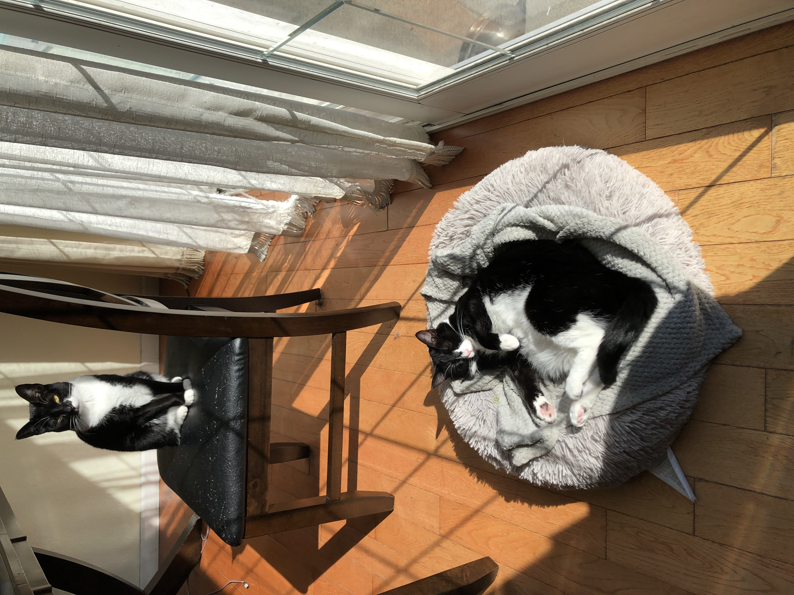

# Qiao Bibi

The Qiao Bibi's are officially the cutest tuxedo cats to have ever existed. Follow [this](https://www.instagram.com/qiao.bibi/) to be blessed. 

 

The Bibi is a self-invented species of Tuxedo cat. The Bibi on the top is Hei Bibi named after her asymmetrical black nose. The Bibi on her bed is Bai Bibi named after her 
asymmetrical predominantly white nose. Both of their names are derived from the romanization of Chinese, phonetically butchered in English into "Hey Baby" and "Bye Baby."

